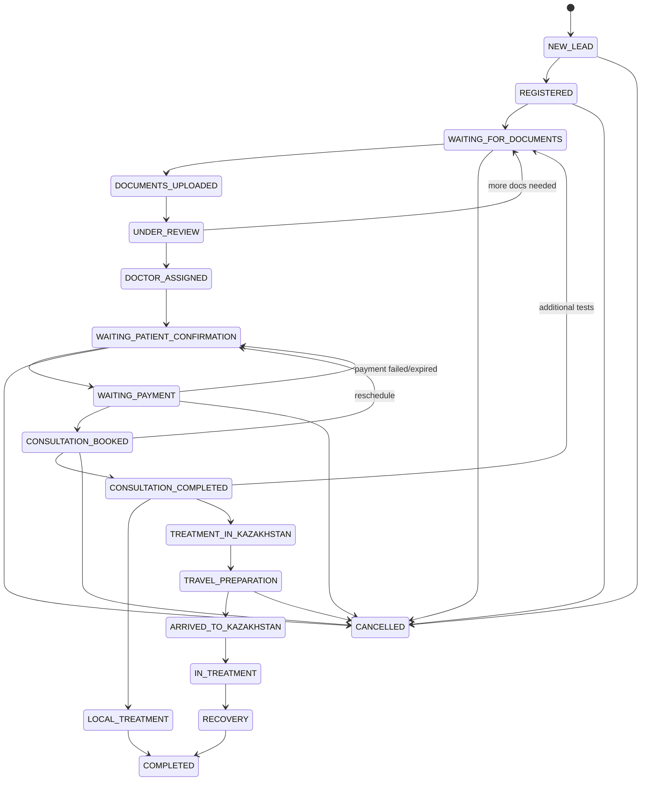
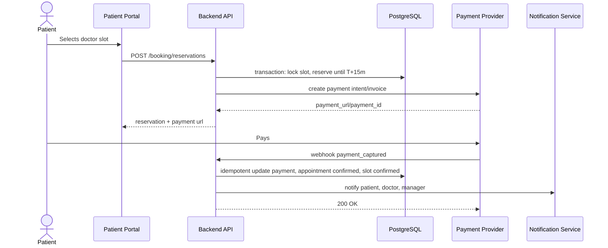
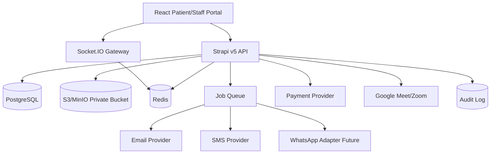
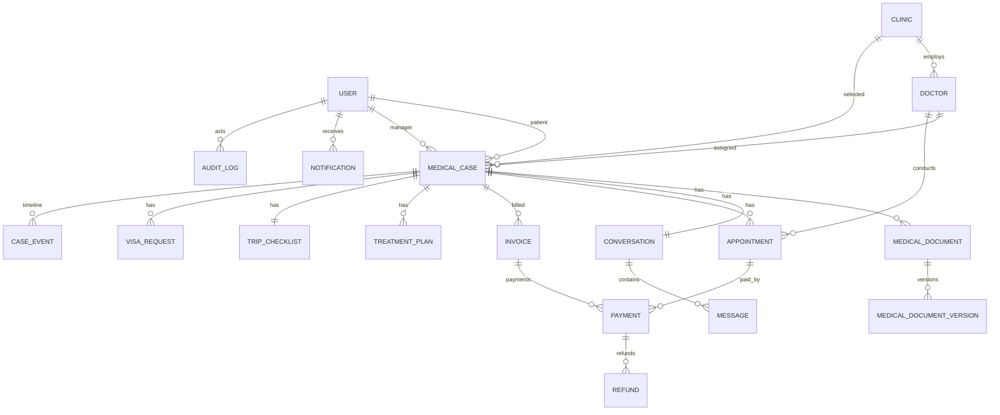

# Kazakhstan Med Travel - Enterprise Architecture

Версия: 1.0  
Дата: 2026-05-20  
Контекст: проект строится как case-first MedTech/medical tourism CRM, а не как публичный marketplace врачей.

## 1. Executive Summary

Kazakhstan Med Travel - enterprise платформа медицинского туризма для иностранных пациентов. Главный бизнес-объект платформы - `MedicalCase`. Все остальные объекты существуют вокруг кейса: документы, чат, записи на консультации, платежи, план лечения, визовая поддержка, логистика, туризм и post-care.

Целевой продукт закрывает полный путь пациента:

1. Landing page и lead capture.
2. Регистрация и onboarding.
3. Создание medical case.
4. Загрузка медицинских документов.
5. Назначение менеджера и медицинского координатора.
6. Подбор клиники и врача.
7. Онлайн-консультация.
8. Вердикт врача.
9. План лечения.
10. Оплата.
11. При необходимости - запуск medical tourism workflow.
12. Виза, билеты, отель, трансфер.
13. Лечение в Казахстане.
14. Восстановление, туризм, выписка.
15. Follow-up после возвращения домой.

Для MVP рекомендуется оставить модульный монолит на текущем стеке:

- Frontend: React + Vite.
- Backend: Strapi v5.
- DB: PostgreSQL.
- Realtime: Socket.IO.
- Storage: S3/MinIO.
- Payments: external PSP через redirect/payment intent/webhooks.
- Video MVP: Google Meet или Zoom.

В V2/V3 критичные домены можно выделять в отдельные сервисы: Realtime, Booking, Payments, Notifications, Medical Documents, AI Translation, AI Summaries.

## 2. Product Principles

1. Case-first, not doctor-first: пациент не выбирает врача самостоятельно на первом шаге. Команда подбирает врача после анализа документов.
2. Manager-led journey: пациент ощущает персональное сопровождение, а не self-service без помощи.
3. Medical privacy by default: доступ к медицинским данным только по назначению и роли.
4. Audit everything: каждое чувствительное действие логируется.
5. Timezone-safe booking: все даты хранятся в UTC, UI показывает время в timezone пациента и врача.
6. Payment confirms booking: слот резервируется временно и подтверждается только после оплаты.
7. Human override: менеджер/admin могут решать edge cases, но каждое ручное изменение фиксируется в audit log.
8. External integrations are adapters: WhatsApp, Telegram, Zoom, Google Meet, PSP не должны протекать в доменную модель напрямую.

## 3. Current Repository Fit

Текущий репозиторий уже содержит правильное направление:

- `MedicalCase` как центральная сущность.
- Связи с `Appointment`, `MedicalDocument`, `Conversation`, `TreatmentPlan`, `TripChecklist`, `VisaRequest`, `TourismPackage`, `CaseEvent`.
- Workflow в `server/src/utils/medical-case-workflow.ts`.
- Frontend dashboards для staff.
- Payment/refund ledger.

Рекомендация: нормализовать существующие статусы под целевой CRM lifecycle из нового ТЗ. В коде сейчас используются статусы вроде `NEW`, `DOCS_PENDING`, `MATCHING`, `VISA_PROCESS`; целевой enterprise lifecycle ниже использует более явные CRM-статусы.

## 4. Target Roles

Минимальный набор ролей из ТЗ:

- `patient`
- `doctor`
- `manager`
- `admin`

Enterprise-рекомендация: добавить `medical_coordinator` и `logistics_specialist` как отдельные staff-роли. Если команда хочет держать только 4 роли в MVP, их обязанности можно временно включить в `manager` и `admin`, но в RBAC нужно оставить доменные permissions, чтобы позже отделить роли без миграции бизнес-логики.

## 5. RBAC Matrix

### 5.1 Permission Groups

| Domain | Permissions |
|---|---|
| Auth | login, logout, refresh_session, manage_sessions |
| Patient Profile | read_own_profile, update_own_profile, read_patient_profile, update_patient_profile |
| Medical Case | create_case, read_own_case, read_assigned_case, read_all_cases, update_case_patient_fields, update_case_staff_fields, assign_manager, assign_doctor, change_case_status, cancel_case |
| Documents | upload_own_document, read_own_document, delete_own_unreviewed_document, read_assigned_documents, upload_staff_document, download_document, approve_document, quarantine_document |
| Chat | read_own_chat, send_own_chat, read_assigned_chat, send_staff_chat, takeover_chat, close_chat, view_all_chats |
| Booking | view_available_slots, reserve_slot, confirm_booking, cancel_own_booking, manage_doctor_slots, cancel_booking_staff, reschedule_booking |
| Payment | create_own_payment, read_own_payment, read_assigned_payments, confirm_payment_webhook, request_refund, approve_refund, reconcile_payments |
| Video | join_own_consultation, join_assigned_consultation, create_meeting_room, manage_recording |
| Treatment Plan | read_own_plan, create_assigned_plan, update_assigned_plan, approve_plan, accept_plan, decline_plan |
| Logistics | manage_visa, manage_flights, manage_hotel, manage_transfer, manage_trip_checklist |
| Notifications | read_own_notifications, send_case_notification, manage_templates |
| Audit | read_own_audit_summary, read_case_audit, read_all_audit |
| Admin | manage_users, manage_roles, manage_clinics, manage_doctors, manage_settings |

### 5.2 Role Permissions

| Role | Can See | Can Edit | Medical Documents | Chats | Assignments | Status Changes |
|---|---|---|---|---|---|---|
| Patient | Own profile, own cases, own documents, own bookings, own payments, own treatment plans | Own profile, own case intake fields, upload documents, choose slot, cancel by policy, accept/decline plan | Own uploaded docs and staff-shared docs | Own case chat | Cannot assign | Patient-driven statuses: docs uploaded, confirmation, cancellation request |
| Doctor | Assigned cases, assigned appointments, clinical documents needed for consultation, treatment history in assigned scope | Doctor notes, verdict, recommendations, consultation summary | Read assigned case docs through signed URLs; upload clinical result files | Assigned consultation/case chat if enabled | Cannot assign other doctors | Consultation completed, local treatment, Kazakhstan treatment, additional tests required |
| Manager | Assigned patients/cases, pipeline, chats, bookings, payment state, logistics | Case coordination fields, patient notes, logistics, reminders, booking coordination | Read assigned docs, upload staff docs, request translations | Assigned chats, shared manager inbox, takeover | Can assign self/manager; in MVP can request/assign doctor if allowed | Most operational statuses except final clinical verdict if restricted |
| Admin | All system data | All admin-controlled data | Full access with audit | All chats with audit | Can assign managers, doctors, coordinators | All statuses, overrides with reason |

### 5.3 Document Access Rules

1. Patient owns uploaded documents but cannot see internal review notes unless shared.
2. Doctor sees only documents for assigned case/appointment.
3. Manager sees assigned case documents for coordination, but sensitive clinical annotations can be hidden if needed.
4. Admin has full access, but every view/download is audited.
5. Signed URLs expire quickly, normally 5-15 minutes.
6. Downloads should require explicit API authorization even if the object is stored in S3/MinIO.

### 5.4 Chat Access Rules

1. Patient sees only own case conversation.
2. Managers see assigned conversations and shared manager queue.
3. A chat can have an `owner_manager_id`, but other managers can participate if the chat is in shared mode.
4. `chat_takeover` must create an audit event.
5. Doctor access to chat should be case-specific and optionally limited to consultation period.
6. Admin can read chats for compliance and support, with audit logging.

## 6. CRM Patient Lifecycle

Target statuses from ТЗ:

```text
NEW_LEAD
REGISTERED
WAITING_FOR_DOCUMENTS
DOCUMENTS_UPLOADED
UNDER_REVIEW
DOCTOR_ASSIGNED
WAITING_PATIENT_CONFIRMATION
WAITING_PAYMENT
CONSULTATION_BOOKED
CONSULTATION_COMPLETED
LOCAL_TREATMENT
TREATMENT_IN_KAZAKHSTAN
TRAVEL_PREPARATION
ARRIVED_TO_KAZAKHSTAN
IN_TREATMENT
RECOVERY
COMPLETED
CANCELLED
```

### 6.1 State Machine



### 6.2 Transition Ownership

| From | To | Actor | Automation |
|---|---|---|---|
| NEW_LEAD | REGISTERED | Patient/System | After successful account creation |
| REGISTERED | WAITING_FOR_DOCUMENTS | System | Create default case and onboarding tasks |
| WAITING_FOR_DOCUMENTS | DOCUMENTS_UPLOADED | Patient/System | After first valid medical document upload |
| DOCUMENTS_UPLOADED | UNDER_REVIEW | Manager/Admin/System | Auto when required docs threshold is met |
| UNDER_REVIEW | DOCTOR_ASSIGNED | Manager/Admin | After doctor selected |
| UNDER_REVIEW | WAITING_FOR_DOCUMENTS | Doctor/Manager/Admin | More documents or tests required |
| DOCTOR_ASSIGNED | WAITING_PATIENT_CONFIRMATION | System/Manager | Publish available slots to patient |
| WAITING_PATIENT_CONFIRMATION | WAITING_PAYMENT | Patient/System | Patient reserves slot |
| WAITING_PAYMENT | CONSULTATION_BOOKED | Payment webhook/System | Payment captured or authorized |
| WAITING_PAYMENT | WAITING_PATIENT_CONFIRMATION | System | Reservation timeout or failed payment |
| CONSULTATION_BOOKED | CONSULTATION_COMPLETED | Doctor/Admin/System | Doctor completes consultation and verdict |
| CONSULTATION_COMPLETED | LOCAL_TREATMENT | Doctor/Manager/Admin | Doctor verdict |
| CONSULTATION_COMPLETED | TREATMENT_IN_KAZAKHSTAN | Doctor/Manager/Admin | Doctor verdict |
| TREATMENT_IN_KAZAKHSTAN | TRAVEL_PREPARATION | Manager/Admin | Patient accepts treatment plan |
| TRAVEL_PREPARATION | ARRIVED_TO_KAZAKHSTAN | Manager/Admin | Arrival confirmed |
| ARRIVED_TO_KAZAKHSTAN | IN_TREATMENT | Manager/Admin | First clinical visit started |
| IN_TREATMENT | RECOVERY | Manager/Admin | Treatment completed, recovery stage |
| RECOVERY | COMPLETED | Manager/Admin | Discharge docs and post-care complete |
| Any non-terminal | CANCELLED | Patient/Manager/Admin | By cancellation policy; reason required |

### 6.3 Automation Logic

1. On registration: create `patient_profile`, `medical_case`, `conversation`, onboarding checklist, notification preferences.
2. On document upload: virus scan, validate metadata, create `document_version`, notify manager queue.
3. SLA timers:
   - NEW_LEAD: manager contact within 2 hours business time.
   - WAITING_FOR_DOCUMENTS: reminder after 24h and 48h.
   - UNDER_REVIEW: coordinator/manager reminder after 24h.
   - WAITING_PAYMENT: reservation expiry reminders at T-30 and T-10 minutes.
4. On doctor assignment: generate patient-facing available slot view.
5. On slot reservation: lock slot and create payment invoice.
6. On payment captured: confirm booking, create Google Meet/Zoom link, notify patient/doctor/manager.
7. On consultation completed: require doctor verdict before moving to clinical outcome statuses.
8. On `TREATMENT_IN_KAZAKHSTAN`: auto-create trip checklist tasks.
9. On `COMPLETED`: trigger NPS/review and post-care schedule.

## 7. Chat System Architecture

### 7.1 Requirements

MVP:

- Socket.IO realtime messages.
- Persistent history.
- File/image upload.
- Online/offline status.
- Typing indicator.
- Unread counters.
- Read receipts.
- Shared manager inbox.
- Chat takeover.
- Notifications.
- Audit logging.

Future:

- WhatsApp Business integration.
- Telegram Bot integration.
- Omnichannel inbox.
- Auto-translation.
- AI summaries.

### 7.2 Components

```text
React Chat Widget
  -> Socket.IO Gateway
  -> Chat Application Service
  -> PostgreSQL chat tables
  -> S3/MinIO attachments
  -> Notification Queue
  -> Audit Log

Socket.IO Gateway
  -> Redis Adapter for horizontal scaling
  -> Redis presence keys
  -> JWT auth middleware
```

### 7.3 Chat Database Schema

```sql
conversation (
  id uuid primary key,
  medical_case_id uuid null references medical_case(id),
  patient_id uuid not null references user(id),
  owner_manager_id uuid null references user(id),
  status varchar not null check (status in ('open','pending','closed','archived')),
  channel varchar not null default 'in_app',
  last_message_at timestamptz,
  last_message_preview text,
  created_at timestamptz not null,
  updated_at timestamptz not null
);

conversation_participant (
  id uuid primary key,
  conversation_id uuid not null references conversation(id),
  user_id uuid not null references user(id),
  role varchar not null,
  joined_at timestamptz not null,
  left_at timestamptz,
  last_read_message_id uuid null,
  last_read_at timestamptz,
  muted_until timestamptz,
  unique (conversation_id, user_id)
);

message (
  id uuid primary key,
  conversation_id uuid not null references conversation(id),
  sender_id uuid null references user(id),
  sender_type varchar not null check (sender_type in ('user','system','integration')),
  type varchar not null check (type in ('text','file','image','system','payment','booking')),
  body text,
  metadata jsonb not null default '{}',
  client_message_id varchar null,
  created_at timestamptz not null,
  edited_at timestamptz,
  deleted_at timestamptz,
  unique (conversation_id, client_message_id)
);

message_attachment (
  id uuid primary key,
  message_id uuid not null references message(id),
  document_id uuid null references medical_document(id),
  storage_key text not null,
  file_name text not null,
  mime_type varchar not null,
  size_bytes bigint not null,
  checksum_sha256 varchar not null,
  created_at timestamptz not null
);

message_receipt (
  id uuid primary key,
  message_id uuid not null references message(id),
  user_id uuid not null references user(id),
  delivered_at timestamptz,
  read_at timestamptz,
  unique (message_id, user_id)
);

chat_takeover_event (
  id uuid primary key,
  conversation_id uuid not null references conversation(id),
  from_manager_id uuid null references user(id),
  to_manager_id uuid not null references user(id),
  reason text,
  created_by uuid not null references user(id),
  created_at timestamptz not null
);
```

### 7.4 WebSocket Events

Client -> Server:

```text
auth:connect
conversation:join
conversation:leave
message:send
message:update
message:delete
message:read
typing:start
typing:stop
presence:heartbeat
attachment:prepare_upload
attachment:complete_upload
chat:takeover
```

Server -> Client:

```text
conversation:state
message:new
message:updated
message:deleted
message:delivered
message:read
typing:update
presence:update
unread:update
manager_presence:update
chat:takeover
notification:new
error
```

### 7.5 Presence Logic

Redis keys:

```text
presence:user:{userId} -> online/offline metadata, TTL 60s
presence:role:manager -> set of online manager ids
presence:conversation:{conversationId} -> active participants
```

Patient-facing rule:

```text
if count(online managers) > 0:
  show "Manager online"
else:
  show "We will reply later"
```

Do not rely only on Socket.IO disconnect event; mobile/browser disconnects are unreliable. Use heartbeat + TTL.

### 7.6 Scaling Strategy

1. Socket.IO servers are stateless.
2. Use `@socket.io/redis-adapter`.
3. Use Redis for presence, typing TTL, room fanout metadata and rate limit counters.
4. Persist messages through backend service before broadcasting.
5. Use idempotency key `client_message_id` to avoid duplicates on reconnect.
6. Use queue for push/email/SMS notifications after DB commit.
7. For large deployments, split chat into dedicated service with its own database schema.

### 7.7 WhatsApp/Telegram Future

Add `external_channel_account` and `external_message_mapping`:

```sql
external_channel_account (
  id uuid primary key,
  channel varchar not null check (channel in ('whatsapp','telegram')),
  provider varchar not null,
  external_account_id text not null,
  display_name text,
  status varchar not null
);

external_message_mapping (
  id uuid primary key,
  message_id uuid references message(id),
  channel varchar not null,
  external_message_id text not null,
  payload jsonb not null,
  created_at timestamptz not null,
  unique(channel, external_message_id)
);
```

All external messages must be converted to internal `message` records. Internal chat remains the source of truth.

## 8. Hybrid Booking System

### 8.1 Booking Principle

Manager assigns doctor first. Patient can choose slots only for assigned doctor/case. Booking is not confirmed until payment is completed.

### 8.2 Entities

```sql
doctor_schedule (
  id uuid primary key,
  doctor_id uuid not null references doctor(id),
  timezone varchar not null,
  slot_duration_minutes int not null default 30,
  buffer_before_minutes int not null default 0,
  buffer_after_minutes int not null default 10,
  active boolean not null default true
);

doctor_availability_rule (
  id uuid primary key,
  schedule_id uuid not null references doctor_schedule(id),
  day_of_week int not null,
  start_local_time time not null,
  end_local_time time not null,
  valid_from date,
  valid_to date,
  recurrence varchar not null default 'weekly'
);

doctor_time_off (
  id uuid primary key,
  doctor_id uuid not null references doctor(id),
  starts_at timestamptz not null,
  ends_at timestamptz not null,
  reason text
);

booking_slot (
  id uuid primary key,
  doctor_id uuid not null references doctor(id),
  medical_case_id uuid not null references medical_case(id),
  starts_at timestamptz not null,
  ends_at timestamptz not null,
  status varchar not null check (status in ('available','reserved','confirmed','cancelled','expired','completed','no_show')),
  reserved_by uuid null references user(id),
  reserved_until timestamptz,
  appointment_id uuid null references appointment(id),
  created_at timestamptz not null,
  updated_at timestamptz not null
);

appointment (
  id uuid primary key,
  medical_case_id uuid not null references medical_case(id),
  patient_id uuid not null references user(id),
  doctor_id uuid not null references doctor(id),
  slot_id uuid not null references booking_slot(id),
  starts_at timestamptz not null,
  ends_at timestamptz not null,
  status varchar not null check (status in ('pending_payment','confirmed','in_progress','completed','cancelled','no_show')),
  meeting_provider varchar,
  meeting_url text,
  meeting_external_id text,
  created_at timestamptz not null,
  updated_at timestamptz not null
);
```

### 8.3 Double Booking Prevention

Use database-level protection, not only application checks.

Recommended PostgreSQL exclusion constraint:

```sql
create extension if not exists btree_gist;

alter table appointment
add constraint no_overlapping_confirmed_appointments
exclude using gist (
  doctor_id with =,
  tstzrange(starts_at, ends_at, '[)') with &&
)
where (status in ('pending_payment', 'confirmed', 'in_progress'));
```

For reservations:

1. Start DB transaction.
2. Lock generated slot row with `select ... for update`.
3. Check not expired and status available.
4. Set `status='reserved'`, `reserved_until=now()+15 minutes`.
5. Create invoice/payment intent.
6. Commit.

### 8.4 Timezone Support

1. Store all timestamps in UTC.
2. Store patient timezone in `medical_case.timezone` or `patient_profile.timezone`.
3. Store doctor timezone in `doctor_schedule.timezone`.
4. UI must always show:
   - patient local time,
   - doctor local time,
   - Kazakhstan time if relevant.
5. Use IANA timezone names, for example `Asia/Almaty`, `Europe/Istanbul`, `Asia/Dubai`, not numeric offsets.

### 8.5 Cancellation and Rescheduling

Policy fields:

```sql
booking_policy (
  id uuid primary key,
  consultation_type varchar not null,
  free_cancel_until_hours int not null default 24,
  free_reschedule_until_hours int not null default 12,
  no_show_grace_minutes int not null default 10,
  refund_percent_before_deadline int not null default 100,
  refund_percent_after_deadline int not null default 0
);
```

Rules:

1. Patient cancellation before deadline: cancel appointment, release slot, create full refund request.
2. Patient cancellation after deadline: staff review, partial/no refund depending on policy.
3. Doctor cancellation: release slot, offer priority reschedule, full refund if patient declines.
4. Rescheduling creates new reservation and releases old slot only after new booking is confirmed, unless staff override.
5. Every cancellation/reschedule requires reason and audit event.

### 8.6 Reminders

Default:

- T-24h email/WhatsApp/SMS.
- T-2h push/email.
- T-15m in-app/push.
- Doctor reminder T-30m.
- Manager reminder if VIP/urgent or interpreter required.

## 9. Payment Flow

### 9.1 Payment Statuses

```text
invoice_draft
invoice_issued
payment_pending
payment_authorized
payment_captured
payment_failed
payment_expired
payment_cancelled
refund_requested
refund_approved
refund_processing
refund_completed
refund_failed
partially_paid
partially_refunded
```

### 9.2 Payment Entities

```sql
invoice (
  id uuid primary key,
  medical_case_id uuid not null references medical_case(id),
  appointment_id uuid null references appointment(id),
  patient_id uuid not null references user(id),
  invoice_number varchar not null unique,
  currency char(3) not null,
  subtotal_amount numeric(12,2) not null,
  tax_amount numeric(12,2) not null default 0,
  total_amount numeric(12,2) not null,
  paid_amount numeric(12,2) not null default 0,
  status varchar not null,
  due_at timestamptz,
  created_at timestamptz not null
);

invoice_line (
  id uuid primary key,
  invoice_id uuid not null references invoice(id),
  item_type varchar not null,
  description text not null,
  quantity numeric(12,2) not null default 1,
  unit_amount numeric(12,2) not null,
  total_amount numeric(12,2) not null
);

payment (
  id uuid primary key,
  invoice_id uuid not null references invoice(id),
  provider varchar not null,
  provider_payment_id text,
  idempotency_key varchar not null unique,
  amount numeric(12,2) not null,
  currency char(3) not null,
  status varchar not null,
  failure_code text,
  failure_message text,
  authorized_at timestamptz,
  captured_at timestamptz,
  expires_at timestamptz,
  created_at timestamptz not null
);

payment_event (
  id uuid primary key,
  payment_id uuid null references payment(id),
  provider varchar not null,
  provider_event_id text not null,
  event_type varchar not null,
  payload jsonb not null,
  received_at timestamptz not null,
  processed_at timestamptz,
  unique(provider, provider_event_id)
);

refund (
  id uuid primary key,
  payment_id uuid not null references payment(id),
  amount numeric(12,2) not null,
  currency char(3) not null,
  reason text not null,
  status varchar not null,
  requested_by uuid references user(id),
  approved_by uuid references user(id),
  provider_refund_id text,
  created_at timestamptz not null
);
```

### 9.3 Booking + Payment Sequence



### 9.4 Timeout Logic

1. Reservation has `reserved_until`.
2. Background job runs every minute.
3. If `reserved_until < now()` and payment not captured:
   - slot -> `expired`,
   - appointment -> cancelled or removed if not externally visible,
   - invoice -> `payment_expired`,
   - patient status -> `WAITING_PATIENT_CONFIRMATION`,
   - notification -> "reservation expired".
4. Webhook after timeout must be handled idempotently:
   - if provider captured money after local expiry, either confirm if slot still free or create staff task for refund/reschedule.

### 9.5 Partial Payments

Use only if business requires deposits for travel/treatment packages.

Rules:

1. Consultation booking should generally require full payment.
2. Treatment package may allow deposit + remaining balance.
3. Invoice status is `partially_paid` until `paid_amount >= total_amount`.
4. Access to consultation/travel services should be gated by invoice line policy, not only invoice total.

## 10. Video Consultation Module

### 10.1 MVP Providers

Use Google Meet or Zoom in MVP. Do not build custom WebRTC before product-market and operational flows are stable.

### 10.2 Lifecycle

```text
scheduled -> meeting_created -> reminders_sent -> waiting_room -> in_progress -> completed -> doctor_notes_required -> summary_sent -> archived
```

### 10.3 Meeting Creation

1. On booking confirmation, create external meeting.
2. Store:
   - `meeting_provider`
   - `meeting_external_id`
   - `meeting_url`
   - `host_url` only encrypted or provider-side, never exposed to patient
   - `starts_at`, `ends_at`
3. Patient sees join button 15 minutes before start.
4. Doctor sees consultation queue and join button 30 minutes before start.

### 10.4 Recording Policy

Default recommendation: recording disabled unless patient explicitly consents.

If enabled:

1. Consent must be captured before recording.
2. Recording belongs to medical case.
3. Access is restricted to patient, assigned doctor, assigned manager/admin.
4. Storage must be encrypted.
5. Retention policy must be defined, for example 3-7 years depending on legal advice.
6. Every playback/download is audited.

### 10.5 Doctor Output

Doctor must complete:

- verdict: `LOCAL_TREATMENT`, `TREATMENT_IN_KAZAKHSTAN`, `ADDITIONAL_TESTS_REQUIRED`.
- diagnosis summary.
- clinical notes.
- recommendations.
- required tests.
- treatment plan draft or handoff to coordinator.
- follow-up date if needed.

### 10.6 Poor Internet Fallback

1. Retry external provider link.
2. Switch video off, use audio.
3. Use in-app chat during consultation.
4. Manager creates phone/WhatsApp fallback task.
5. If consultation cannot happen: reschedule without penalty and preserve payment.
6. Doctor can mark `technical_failure`, not `patient_no_show`.

## 11. Medical Document System

### 11.1 Architecture

```text
Browser
  -> API: request upload policy
  -> S3/MinIO: direct encrypted upload
  -> API: complete upload
  -> Virus Scanner Queue
  -> Document Service
  -> Metadata in PostgreSQL
  -> Audit Log
```

### 11.2 Document Entities

```sql
medical_document (
  id uuid primary key,
  medical_case_id uuid not null references medical_case(id),
  owner_patient_id uuid not null references user(id),
  uploaded_by uuid not null references user(id),
  type varchar not null,
  title text not null,
  status varchar not null check (status in ('uploading','processing','available','quarantined','rejected','deleted')),
  current_version_id uuid null,
  visibility varchar not null default 'case_team',
  created_at timestamptz not null
);

medical_document_version (
  id uuid primary key,
  document_id uuid not null references medical_document(id),
  version_number int not null,
  storage_bucket text not null,
  storage_key text not null,
  original_file_name text not null,
  mime_type varchar not null,
  size_bytes bigint not null,
  checksum_sha256 varchar not null,
  encryption_key_id text,
  scan_status varchar not null check (scan_status in ('pending','clean','infected','failed')),
  created_at timestamptz not null,
  unique(document_id, version_number)
);

document_access_grant (
  id uuid primary key,
  document_id uuid not null references medical_document(id),
  user_id uuid null references user(id),
  role varchar null,
  access_level varchar not null check (access_level in ('read','download','write')),
  expires_at timestamptz,
  created_by uuid references user(id),
  created_at timestamptz not null
);
```

### 11.3 Supported File Types

MVP:

- PDF.
- JPG/PNG/WebP.
- DOC/DOCX if business requires, but convert to PDF for clinical review when possible.

Future:

- DICOM.
- ZIP with DICOM series.
- HL7/FHIR import.

### 11.4 Security Policies

1. Private bucket only; no public ACL.
2. Server-side encryption with managed KMS key.
3. Signed upload URL expires in 5-10 minutes.
4. Signed download URL expires in 5-15 minutes.
5. Validate file extension, MIME type, magic bytes and size.
6. Virus scan before document becomes visible to staff.
7. Quarantine suspicious files.
8. Log upload, scan, view, download, delete, share, version update.
9. For DICOM future: strip/normalize metadata only if clinically and legally appropriate.

## 12. Notification System

### 12.1 Channels

- Email.
- SMS.
- WhatsApp.
- Telegram.
- Push notifications.
- In-app notifications.

### 12.2 Architecture

```text
Domain Event
  -> Notification Orchestrator
  -> Template Renderer
  -> User Preferences
  -> Channel Adapter
  -> Provider
  -> Delivery Event
  -> Retry/DLQ
```

### 12.3 Notification Entities

```sql
notification (
  id uuid primary key,
  user_id uuid not null references user(id),
  medical_case_id uuid null references medical_case(id),
  type varchar not null,
  title text not null,
  body text not null,
  status varchar not null check (status in ('queued','sent','delivered','read','failed')),
  created_at timestamptz not null,
  read_at timestamptz
);

notification_delivery (
  id uuid primary key,
  notification_id uuid not null references notification(id),
  channel varchar not null,
  provider varchar,
  provider_message_id text,
  status varchar not null,
  error text,
  sent_at timestamptz,
  delivered_at timestamptz
);

notification_preference (
  id uuid primary key,
  user_id uuid not null references user(id),
  channel varchar not null,
  enabled boolean not null default true,
  locale varchar not null default 'en',
  timezone varchar,
  quiet_hours jsonb,
  unique(user_id, channel)
);
```

### 12.4 Reminder Types

Patient:

- Complete onboarding.
- Upload missing documents.
- Manager replied in chat.
- Slot reservation expires soon.
- Payment pending.
- Consultation reminders.
- Treatment plan ready.
- Visa/travel task due.
- Post-care follow-up.

Doctor:

- New assigned case.
- Documents ready for review.
- Consultation soon.
- Doctor notes overdue.
- Patient uploaded additional tests.

Manager:

- New lead.
- SLA breach.
- Patient uploaded documents.
- Unread chat.
- Payment failed.
- Patient no-show.
- Travel checklist overdue.

Admin:

- Failed payment webhook.
- Notification provider outage.
- Security/rate-limit anomaly.
- Audit export requested.

## 13. Audit Logs

### 13.1 What to Log

- Login/logout.
- Failed login.
- Token refresh.
- Uploads.
- Downloads/views of medical documents.
- Status changes.
- Booking changes.
- Payment changes.
- Refund actions.
- Doctor assignments.
- Manager assignments.
- Chat takeover.
- Admin actions.
- Role/permission changes.
- Data export/delete requests.

### 13.2 Audit Schema

```sql
audit_log (
  id uuid primary key,
  actor_user_id uuid null references user(id),
  actor_role varchar,
  action varchar not null,
  entity_type varchar not null,
  entity_id uuid,
  medical_case_id uuid null references medical_case(id),
  before jsonb,
  after jsonb,
  ip inet,
  user_agent text,
  request_id varchar,
  reason text,
  created_at timestamptz not null
);
```

### 13.3 Immutability

1. Application users must not have update/delete permissions on audit table.
2. Append-only writes.
3. For stronger immutability: write daily hash chain:

```text
record_hash = sha256(previous_hash + canonical_json(audit_record))
```

4. Export daily audit digest to WORM-capable storage or separate security account.
5. Separate audit read permissions from admin operational permissions.

## 14. Security Requirements

### 14.1 Authentication

1. JWT access token lifetime: 5-15 minutes.
2. Refresh token lifetime: 7-30 days depending on role.
3. Refresh tokens stored in hashed form in DB.
4. Refresh rotation on every use.
5. Reuse detection invalidates token family.
6. Staff/Admin should use MFA.
7. Admin sessions shorter than patient sessions.

### 14.2 Web Security

1. HTTPS only.
2. HSTS enabled.
3. Secure, HttpOnly, SameSite cookies for refresh token.
4. Access token may be in memory; avoid localStorage for sensitive apps.
5. Strict CORS allowlist.
6. CSRF protection for cookie-authenticated mutations.
7. XSS protection via output encoding and sanitization.
8. CSP headers.
9. SQL injection protection through ORM/query builder and parameterized queries.
10. Rate limiting per IP, user and route.
11. Brute force protection with progressive delays/account lock.
12. File upload validation and scanning.
13. Secrets only in secret manager/env, never in repo.

### 14.3 API Security

1. Every endpoint checks authentication, role and object ownership.
2. Do not trust frontend role checks.
3. Use policy middleware for case participation:
   - patient owns case,
   - doctor assigned to case,
   - manager assigned to case,
   - admin.
4. Use idempotency keys for payment, booking and message mutations.
5. Add request IDs and structured logs.
6. Separate public APIs from staff/admin APIs.

### 14.4 HIPAA-like, GDPR-like, Medical Privacy

Not legal advice, but production recommendations:

1. Data minimization: collect only needed clinical/travel data.
2. Purpose limitation: medical docs used only for case handling.
3. Consent capture for processing, sharing with clinics, recording, external messengers.
4. Right to access/export personal data.
5. Right to correction.
6. Retention policy: medical, financial and audit data retained according to local legal advice.
7. DPA/BAA-like agreements with providers handling PHI/medical data.
8. Regional hosting decision documented.
9. Breach response runbook.
10. Role-based least privilege.
11. Encryption in transit and at rest.

## 15. Admin CRM Dashboard

### 15.1 Core Views

- Patient pipeline board by status.
- Case list with filters.
- Patient detail timeline.
- Chat inbox.
- Online managers.
- Doctor schedules.
- Payment tracking.
- Booking statuses.
- Document review queue.
- SLA overdue queue.
- Logistics/travel checklist.

### 15.2 Filters

- Status.
- Country.
- Language.
- Treatment category.
- Urgency.
- Assigned manager.
- Assigned doctor.
- Payment status.
- Booking status.
- Unread chat.
- SLA breach.
- Date range.
- Lead source.

### 15.3 KPIs

- New leads today/week/month.
- Registration conversion.
- Document upload conversion.
- Time to first manager response.
- Time to doctor assignment.
- Consultation booking conversion.
- Payment conversion.
- No-show rate.
- Average case revenue.
- Treatment in Kazakhstan conversion.
- SLA breach count.
- Manager workload.
- Doctor utilization.
- Refund rate.
- NPS/review score.

## 16. Doctor Workspace

### 16.1 UX Flow

1. Doctor logs in.
2. Sees today's consultations and assigned review queue.
3. Opens patient case.
4. Reviews patient summary, documents, previous consultations.
5. Joins video consultation.
6. Fills notes and verdict.
7. Adds recommendations and required tests.
8. Submits consultation summary.
9. Case status changes based on verdict.

### 16.2 Doctor Dashboard Modules

- Calendar.
- Consultation queue.
- Assigned cases.
- Uploaded analyses.
- Patient history.
- Doctor notes.
- Verdict form.
- Recommendations.
- Follow-up recommendations.
- Overdue notes.

### 16.3 Doctor Entities

```sql
doctor_note (
  id uuid primary key,
  medical_case_id uuid not null references medical_case(id),
  appointment_id uuid null references appointment(id),
  doctor_id uuid not null references doctor(id),
  note_type varchar not null,
  content text not null,
  visibility varchar not null default 'internal',
  created_at timestamptz not null,
  updated_at timestamptz not null
);

consultation_summary (
  id uuid primary key,
  appointment_id uuid not null references appointment(id),
  medical_case_id uuid not null references medical_case(id),
  doctor_id uuid not null references doctor(id),
  verdict varchar not null,
  diagnosis_summary text,
  recommendations text,
  required_tests text,
  follow_up_required boolean not null default false,
  follow_up_after_days int,
  patient_visible boolean not null default false,
  created_at timestamptz not null
);
```

## 17. Manager Workspace

### 17.1 Workflow

1. New lead appears in queue.
2. Manager takes/gets assigned case.
3. Contacts patient within SLA.
4. Guides document upload.
5. Coordinates doctor assignment.
6. Helps patient choose slot and pay.
7. Tracks consultation and doctor output.
8. Explains treatment plan.
9. If Kazakhstan treatment: manages visa, tickets, hotel, transfer.
10. Tracks arrival, treatment, recovery.
11. Handles follow-up and review.

### 17.2 Productivity Features

- CRM Kanban board.
- Shared chat inbox with assignment/takeover.
- SLA timers.
- Canned responses/templates.
- Auto-translation in V2.
- Patient timeline.
- Task checklist.
- Calendar coordination.
- Payment reminders.
- Missing document detector.
- Travel checklist templates.
- Internal notes.
- Escalation flags.
- VIP/urgent case flags.

## 18. System Architecture

### 18.1 MVP Architecture



### 18.2 Target Microservice Architecture

Keep this as future, not MVP default.

```text
API Gateway
  Auth Service
  Case/CRM Service
  Booking Service
  Payment Service
  Chat/Realtime Service
  Medical Document Service
  Notification Service
  Video Integration Service
  Analytics Service
  AI Service
```

Migration rule: split a service only when the domain has independent scaling, security or team ownership needs.

### 18.3 API Structure

Public:

```text
GET  /api/public/landing
POST /api/public/leads
GET  /api/public/specializations
GET  /api/public/clinics
```

Auth:

```text
POST /api/auth/register
POST /api/auth/login
POST /api/auth/refresh
POST /api/auth/logout
POST /api/auth/forgot-password
POST /api/auth/reset-password
```

Patient:

```text
GET  /api/me
GET  /api/patient/cases/current
POST /api/patient/cases
PATCH /api/patient/cases/:id/intake
GET  /api/patient/cases/:id/timeline
POST /api/patient/cases/:id/documents/upload-url
POST /api/patient/cases/:id/documents/complete
GET  /api/patient/cases/:id/documents
GET  /api/patient/cases/:id/available-slots
POST /api/patient/cases/:id/reservations
POST /api/patient/bookings/:id/cancel
GET  /api/patient/payments
GET  /api/patient/notifications
```

Staff:

```text
GET  /api/staff/cases
GET  /api/staff/cases/:id
PATCH /api/staff/cases/:id/status
PATCH /api/staff/cases/:id/assign-manager
PATCH /api/staff/cases/:id/assign-doctor
GET  /api/staff/chats
POST /api/staff/chats/:id/takeover
GET  /api/staff/documents/review-queue
GET  /api/staff/bookings
POST /api/staff/bookings/:id/reschedule
GET  /api/staff/payments
POST /api/staff/refunds
```

Doctor:

```text
GET  /api/doctor/dashboard
GET  /api/doctor/calendar
GET  /api/doctor/cases/:id
GET  /api/doctor/appointments
POST /api/doctor/appointments/:id/notes
POST /api/doctor/appointments/:id/verdict
POST /api/doctor/availability
```

Admin:

```text
GET  /api/admin/analytics
GET  /api/admin/audit-logs
POST /api/admin/users
PATCH /api/admin/users/:id/roles
POST /api/admin/clinics
POST /api/admin/doctors
PATCH /api/admin/settings
```

Webhooks:

```text
POST /api/webhooks/payments/:provider
POST /api/webhooks/zoom
POST /api/webhooks/google
POST /api/webhooks/whatsapp
POST /api/webhooks/telegram
```

### 18.4 Folder Structure Recommendation

For Strapi MVP:

```text
server/src/
  api/
    medical-case/
    appointment/
    medical-document/
    conversation/
    message/
    notification/
    treatment-plan/
    trip-checklist/
    finance-ledger/
  domain/
    case-workflow/
    booking/
    payments/
    documents/
    notifications/
  services/
    audit/
    storage/
    virus-scan/
    payment-providers/
    meeting-providers/
  policies/
  middlewares/
  utils/
```

Frontend:

```text
frontend/src/
  app/
  pages/
    public/
    patient/
    doctor/
    staff/
    admin/
  features/
    auth/
    cases/
    chat/
    booking/
    payments/
    documents/
    notifications/
  entities/
  shared/
    api/
    ui/
    hooks/
    i18n/
```

### 18.5 Clean Architecture Rules

1. Domain workflow should not depend on Strapi controller code.
2. Controllers validate request and call application services.
3. Application services enforce business rules and transactions.
4. Provider adapters handle external APIs.
5. Domain events are emitted after DB commit.
6. Frontend state should use API DTOs and avoid duplicating critical workflow rules where possible.

## 19. Database Design

### 19.1 Core Entities

```text
user
patient_profile
doctor
clinic
medical_case
case_event
conversation
message
medical_document
medical_document_version
doctor_schedule
doctor_availability_rule
booking_slot
appointment
invoice
payment
refund
treatment_plan
trip_checklist
visa_request
tourism_package
notification
audit_log
```

### 19.2 ER Diagram



### 19.3 Indexes

```sql
create index idx_case_status on medical_case(status);
create index idx_case_patient on medical_case(patient_id);
create index idx_case_manager on medical_case(manager_id);
create index idx_case_doctor on medical_case(doctor_id);
create index idx_case_country on medical_case(country);
create index idx_case_updated_at on medical_case(updated_at desc);

create index idx_message_conversation_created on message(conversation_id, created_at desc);
create index idx_message_sender on message(sender_id);
create index idx_receipt_user_read on message_receipt(user_id, read_at);

create index idx_document_case on medical_document(medical_case_id);
create index idx_document_status on medical_document(status);

create index idx_appointment_doctor_time on appointment(doctor_id, starts_at);
create index idx_appointment_patient_time on appointment(patient_id, starts_at);
create index idx_appointment_status on appointment(status);

create index idx_payment_invoice on payment(invoice_id);
create index idx_payment_provider_id on payment(provider, provider_payment_id);
create index idx_payment_status on payment(status);

create index idx_audit_entity on audit_log(entity_type, entity_id);
create index idx_audit_case on audit_log(medical_case_id, created_at desc);
create index idx_audit_actor on audit_log(actor_user_id, created_at desc);
```

### 19.4 Optimization Strategy

1. Paginate all lists.
2. Use cursor pagination for chat messages.
3. Use materialized or cached counters for unread messages and dashboard KPIs.
4. Avoid loading all relations in Strapi `populate=*` for dashboards.
5. Add denormalized fields on `medical_case`: `last_activity_at`, `last_message_at`, `sla_due_at`.
6. Archive old chat messages and audit logs to cheaper storage if needed, while keeping searchable metadata.

## 20. BPMN Ideas

### 20.1 Patient Intake BPMN

```text
Start
  -> Lead form submitted
  -> Account created?
    yes -> Create medical case
    no -> Create lead, invite registration
  -> Show onboarding
  -> Request documents
  -> Validate uploads
  -> Notify manager
End
```

### 20.2 Consultation Booking BPMN

```text
Doctor assigned
  -> Generate available slots
  -> Patient selects slot
  -> Reserve slot
  -> Issue invoice
  -> Payment completed?
    yes -> Confirm appointment, create meeting, notify parties
    no -> Reservation expired, release slot, notify patient
```

### 20.3 Treatment In Kazakhstan BPMN

```text
Doctor verdict: treatment in Kazakhstan
  -> Treatment plan sent
  -> Patient accepts?
    no -> local treatment / cancelled / follow-up
    yes -> Create travel checklist
  -> Visa tasks
  -> Flight/hotel/transfer
  -> Arrival confirmation
  -> Treatment visits
  -> Recovery
  -> Discharge documents
  -> Post-care follow-up
```

## 21. MVP Scope

Production-ready MVP V1:

1. Authentication and roles.
2. Patient dashboard.
3. Doctor dashboard.
4. Manager dashboard.
5. Admin dashboard minimal.
6. Case-first CRM statuses.
7. Onboarding modal after registration.
8. Medical document upload with private storage.
9. Chat widget on all patient dashboard pages except videocall.
10. Socket.IO realtime chat.
11. Manager online/offline indicator.
12. Doctor assignment.
13. Available slots after doctor assignment.
14. Slot reservation and timeout.
15. Payment invoice and webhook confirmation.
16. Google Meet/Zoom consultation link.
17. Doctor notes and verdict.
18. Notifications email + in-app; SMS/WhatsApp can be adapter-ready.
19. Audit logs for sensitive actions.
20. Basic deployment with Docker, PostgreSQL, Redis and S3/MinIO.

Explicitly not MVP:

- Custom WebRTC.
- AI doctor assistant.
- Complex multilingual content workflows.
- Native mobile apps.
- Full omnichannel WhatsApp/Telegram inbox.
- Advanced analytics warehouse.

## 22. V2 Scope

1. AI translation.
2. AI consultation/case summaries.
3. Multilingual UI and content management.
4. Mobile app.
5. Analytics dashboard.
6. WhatsApp Business integration.
7. Telegram Bot integration.
8. Document translation workflow.
9. Clinic portal.
10. More granular logistics roles.

## 23. V3 Scope

1. AI doctor assistant.
2. AI recommendations.
3. Smart routing to clinics/doctors.
4. Voice translation.
5. Custom videocalls/WebRTC.
6. AI triage.
7. DICOM viewer.
8. FHIR integrations.
9. Predictive SLA and conversion optimization.

## 24. Edge Cases

| Edge Case | Handling |
|---|---|
| Patient no-show | Wait grace period, manager contacts patient, mark no-show, apply policy, allow staff reschedule override |
| Doctor cancellation | Notify patient immediately, offer alternate slots/doctor, full refund if patient declines |
| Failed payment | Keep reservation until timeout if recoverable, show retry, notify manager after repeated failures |
| Expired slot reservation | Release slot, invoice expired, patient returns to slot selection |
| Timezone conflict | Display both patient and doctor timezone, require confirmation screen before payment |
| Poor internet | Audio-only, chat fallback, phone/WhatsApp fallback, technical failure reschedule |
| Huge file uploads | Direct multipart upload to S3, background processing, max size by type, resume support |
| Duplicate bookings | DB exclusion constraint, idempotency keys, slot transaction locks |
| Manager offline | Show "We will reply later", create unread notification/SLA task |
| Emergency consultation | Urgency flag, priority queue, manual staff override, shorter SLA |
| Refund request | Create refund request, policy calculation, manager/admin approval, provider refund, ledger event |
| Virus detected | Quarantine, hide from users, notify admin/security, audit event |
| Payment webhook duplicated | Idempotency by provider event id |
| Patient uploads wrong document | Allow delete before review or mark replaced; keep audit/version history |
| Patient wants another doctor | Manager changes assignment, previous access revoked, audit event |
| Doctor needs additional tests | Status returns to `WAITING_FOR_DOCUMENTS`, create required tests checklist |

## 25. DevOps

### 25.1 Docker Strategy

Services:

```text
frontend
backend-strapi
socket-gateway
postgres
redis
minio
worker
nginx/reverse-proxy
```

MVP can run backend and worker in one image with different commands.

### 25.2 Environments

- `local`: developer machines, local MinIO/PostgreSQL.
- `dev`: shared testing, seeded data.
- `staging`: production-like, masked data only.
- `production`: real users, strict access.

### 25.3 CI/CD

Pipeline:

1. Install dependencies.
2. Lint.
3. Typecheck.
4. Unit tests.
5. API tests.
6. Build frontend/backend.
7. Security scan dependencies.
8. Docker build.
9. Deploy to staging.
10. Run smoke tests.
11. Manual approval for production.
12. Deploy production.
13. Run post-deploy health checks.

### 25.4 Backups

1. PostgreSQL PITR if available.
2. Daily full backup.
3. Hourly incremental/WAL backup.
4. S3/MinIO bucket versioning.
5. Separate backup credentials.
6. Quarterly restore drills.
7. Backup encryption.

### 25.5 Monitoring and Logging

Metrics:

- API latency.
- Error rate.
- DB connections.
- Queue depth.
- Socket.IO connected users.
- Message delivery latency.
- Payment webhook failures.
- Upload failures.
- Notification failures.
- SLA breaches.

Logs:

- Structured JSON logs.
- Request ID correlation.
- No raw medical document contents in logs.
- No tokens or payment secrets in logs.

Alerts:

- API 5xx spike.
- Payment webhook failures.
- Queue backlog.
- Redis/Postgres unavailable.
- Storage upload failure.
- High login failure rate.
- Notification provider outage.

### 25.6 Horizontal Scaling

1. Backend API: stateless replicas behind load balancer.
2. Socket.IO: replicas with Redis adapter.
3. Workers: horizontally scalable, idempotent jobs.
4. PostgreSQL: primary + read replica for analytics if needed.
5. Storage: S3/MinIO scalable object storage.
6. Redis: managed Redis or HA setup.

## 26. Production Readiness Checklist

Before production:

1. RBAC tested for each role and object ownership.
2. Payment webhook idempotency tested.
3. Booking race condition test with parallel requests.
4. Signed URL expiry tested.
5. Virus scan path tested.
6. Audit logs written for every sensitive action.
7. Backups configured and restore tested.
8. Monitoring and alerts configured.
9. Rate limits configured.
10. CORS/CSRF/CSP configured.
11. Secrets rotated and stored outside repo.
12. Admin MFA enabled.
13. Privacy policy, consent text and terms reviewed by legal counsel.
14. Incident response runbook ready.
15. Data retention policy approved.

## 27. Recommended Implementation Order

1. Normalize role model and target statuses.
2. Lock down RBAC/object ownership policies.
3. Implement case-first patient onboarding.
4. Implement secure document upload pipeline.
5. Implement Socket.IO chat with persistence and manager presence.
6. Implement doctor assignment and slot reservation.
7. Implement payment invoices/webhooks and booking confirmation.
8. Implement video provider adapter.
9. Implement doctor verdict and treatment plan.
10. Implement notifications and reminders.
11. Implement audit logs.
12. Harden security and DevOps.
13. Add dashboards/KPIs.

## 28. Status Mapping From Current Code

If the current code uses existing statuses, migrate gradually:

| Current | Target |
|---|---|
| NEW | NEW_LEAD or REGISTERED |
| DOCS_PENDING | WAITING_FOR_DOCUMENTS |
| ASSIGNED | UNDER_REVIEW |
| IN_REVIEW | UNDER_REVIEW |
| MATCHING | DOCTOR_ASSIGNED |
| CONSULTATION_SCHEDULED | CONSULTATION_BOOKED |
| CONSULTATION_COMPLETED | CONSULTATION_COMPLETED |
| PLAN_FORMING | CONSULTATION_COMPLETED |
| PLAN_READY | WAITING_PATIENT_CONFIRMATION |
| PATIENT_DECISION | WAITING_PATIENT_CONFIRMATION |
| CONFIRMED | TREATMENT_IN_KAZAKHSTAN or LOCAL_TREATMENT depending on verdict |
| VISA_PROCESS | TRAVEL_PREPARATION |
| TRAVEL_ARRANGED | TRAVEL_PREPARATION |
| ARRIVED | ARRIVED_TO_KAZAKHSTAN |
| IN_TREATMENT | IN_TREATMENT |
| DISCHARGED | RECOVERY |
| POST_CARE | RECOVERY |
| COMPLETED | COMPLETED |
| NO_TREATMENT_NEEDED | LOCAL_TREATMENT or COMPLETED |
| CANCELLED | CANCELLED |

Recommended migration: add target statuses first, support both in API response if needed, then migrate records, then remove old statuses from UI and workflow.
